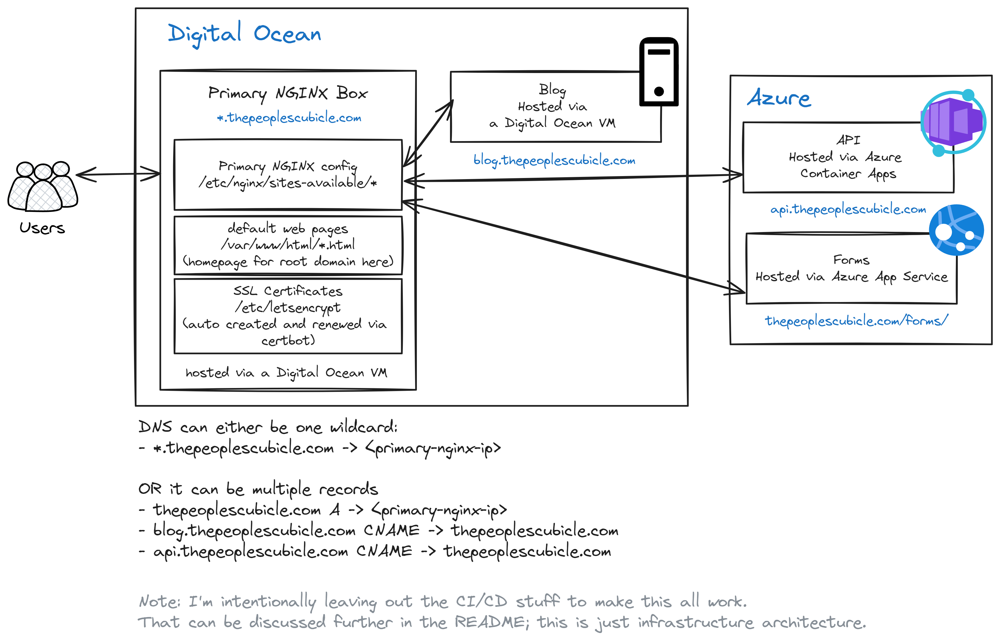

# NginxServiceHub
an NGINX proof of concept that highlights how you can centralize multiple services behind a single reverse proxy

## Architecture 

The architecture diagram above shows how you can use one NGINX box as the core of multiple services in either a multi-cloud or cloud-hybrid environment. 
This architecture can make scaling, and transitioning services (either by subdomain, path, or primary domain) much safer than direct DNS changes. I will document more benefits to this approach later 

### Architectural weaknesses

the NGINX at the top of the "pyramid" (or the entrypoint server) is a single point of failure. 

Here are a few  ways to de-risk this 
1. By adding 2 more NGINX servers below the primary with shared config that are load balanced; make the entrypoint NGINX server as simple as possible and just have it do the load balancing and SSL termination. While you still have a single point of failure, you reduce the config-altering foot traffic needed on your primary entrypoint this way.
2. By utilizing an Azure/AWS/GCP load balancing solution (see [Azure Load Balancer](https://learn.microsoft.com/en-us/azure/load-balancer/load-balancer-overview)) that is managed and gaurantees an uptime SLA. Being honest, I think this solution is also far from perfect. You end up beholden to a vendor and your reverse-proxy/load balancing software is oftentimes abstracted away from you in a UI. However, 99.99% of the time AWS or Azure are going to be able to provide a pretty solid product with proper uptime.
3. Implement an anycast network, with multiple replicas of your infrastructure or at the very least your entrypoint NGINX servers. You can read more about this on the [cloudflare blog](https://www.cloudflare.com/en-ca/learning/cdn/glossary/anycast-network/) or the [render blog](https://render.com/blog/how-to-build-an-anycast-network).

## Setup

### NGINX Setup

1. clone this repository onto your NGINX box
2. `ln -ls` the `nginx/sites-enabled` folder to `/etc/nginx/`. This contains all the individual site config.
    1. Edit all the sites to point to your services. (more info TBD)
3. `ln -s` the `nginx/nginx.conf` file to `/etc/nginx/nginx.conf`. This replaces your default configuration
4. Test NGINX to make sure it's working how you'd like with `nginx -t`
5. Restart the service with `nginx -s reload`

### Services Setup

tbd